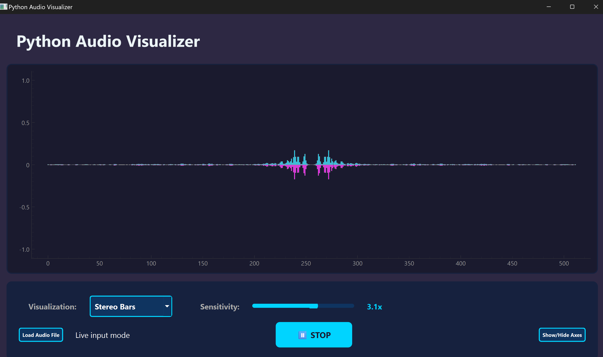
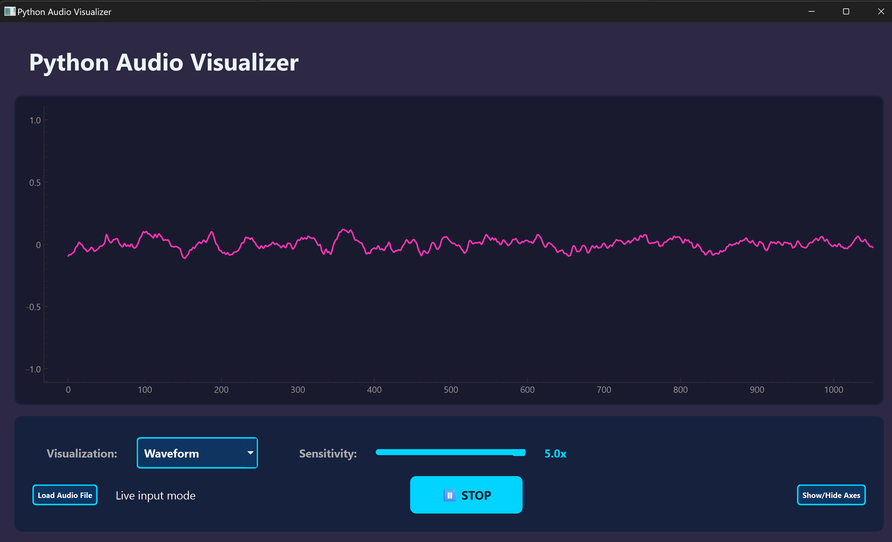
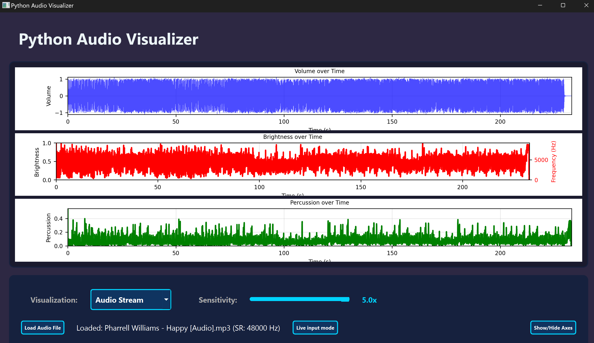

# Audio Visualizer

Turns microphone or audio file input into visualization.

Goal: Perform audio signal processing using 2 methods: live mic input and file input. Visualize the processed audio signals in real-time.

### Features
- Audio visualization of microphone input across time
    - Using Matplotlib graphing
- Real-time waveform visualization of frequency spectrum
    - Using single Qt window
- Audio visualization of file input
    - Processes sound using Librosa and graphs results

### How to Run the Code
- Navigate to the `qt_live_input.py` file and click run
- This will open a new PyQt window
- Click the start button to begin visualizing audio
- Explore different visualization modes through the dropdowns and toggles

### Requirements and Dependencies
- Python 3.10.9 or higher
- Numpy
- Matplotlib
- PyQt6
- Librosa
- Sounddevice

### Approach
- Implement the 2 modes (live input and file input) independently while exploring methods to improve visuals, then integrate.

- `qt_live_input.py`: real-time visual of sound using PyQt plot widget
    - uses sounddevice.InputStream() to record signal over frequency
    - sends input stream directly to plot through automatic PyQt handling
    - uses numpy for managing data
- `file_input_visual.py`: accepts audio file input, processes its' data and then visualizes it
    - uses Librosa to get data for volume, brightness and percussion from the audio file
    - volume - raw data loaded in through Librosa
    - brightness - spectral centroids, or where most of the sound's frequencies are
    - percussion - zero crossing rate, or when the waveform crosses 0 Db

### Results
Stereo Bars in live input mode

Waveform in live input mode

File input mode
